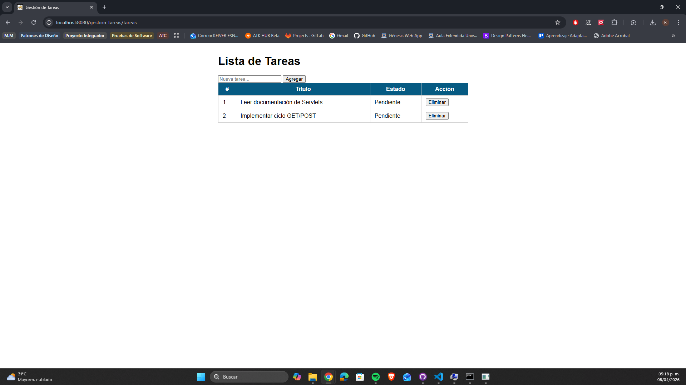
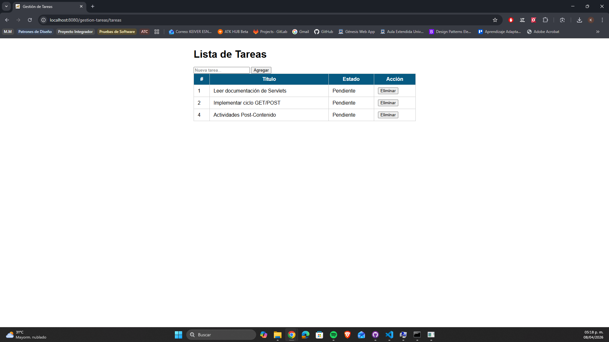
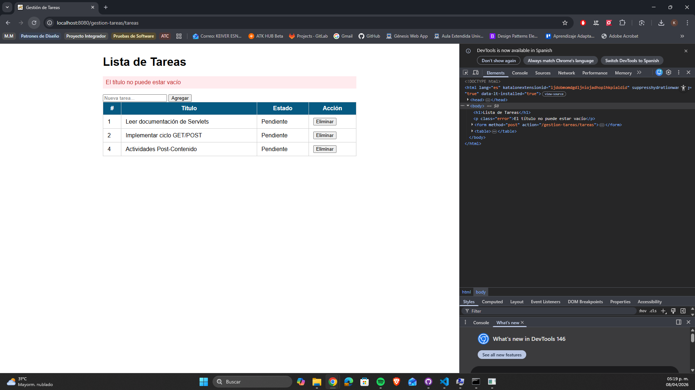

# Gestión de Tareas con Servlet — Post-Contenido 1 Unidad 5

Aplicación web Java desarrollada con Servlets y JSP que permite gestionar
una lista de tareas en memoria. Implementa el patrón Post/Redirect/Get (PRG)
para evitar el reenvío de formularios al recargar la página.

## Tecnologías utilizadas

- Java 21
- Jakarta Servlet API 6.0
- JSTL 3.0
- Apache Tomcat 10.1.52
- Maven 3.9.12

## Estructura del proyecto

src/
├── main/
│ ├── java/
│ │ └── com/ejemplo/
│ │ ├── model/
│ │ │ └── Tarea.java
│ │ └── servlet/
│ │ └── TareasServlet.java
│ └── webapp/
│ ├── WEB-INF/
│ │ ├── views/
│ │ │ └── tareas.jsp
│ │ └── web.xml
│ └── index.jsp

## Requisitos previos

- Java 17 o superior
- Apache Tomcat 10.x
- Maven 3.8+

## Instrucciones de ejecución

**1. Clonar el repositorio**

```bash
git clone https://github.com/tu-usuario/castellanos-post1-u5.git
cd castellanos-post1-u5
```

**2. Compilar el proyecto**

```bash
mvn clean package
```

**3. Desplegar en Tomcat**

Copiar el archivo WAR generado a la carpeta webapps de Tomcat:

```bash
copy target\gestion-tareas.war C:\tomcat10\webapps\
```

**4. Iniciar Tomcat**

```bash
C:\tomcat10\bin\startup.bat
```

**5. Acceder a la aplicación**

Abrir el navegador en:

http://localhost:8080/gestion-tareas/tareas

## Funcionalidades

- **Listar tareas** — muestra todas las tareas almacenadas en memoria (GET)
- **Agregar tarea** — formulario POST con validación en el servidor
- **Eliminar tarea** — elimina por ID mediante POST
- **Validación** — título vacío muestra mensaje de error sin agregar tarea
- **Patrón PRG** — redirige después de cada POST para evitar reenvío

## Capturas de pantalla

### Lista inicial de tareas



### Tarea agregada exitosamente



### Validación de título vacío


